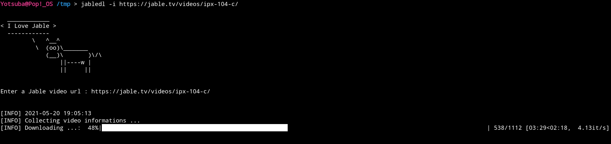

# jabledl

jabledl is a video downloader for Jable TV.

## Screenshot



## Dependency

jabledl depends on [FFmpeg](https://www.ffmpeg.org/) to convert MPEG2-TS file to MP4.

## Install

Clone this repository

```
$ git clone https://github.com/Yooootsuba/jabledl.git
```

Install jabledl

```
$ sudo python3 setup.py install
```

## Usage

Interactive mode

```
$ jabledl
```

Non-interactive mode

```
$ jabledl -i https://jable.tv/videos/CAR-NUMBER/
```

## License

MIT License
